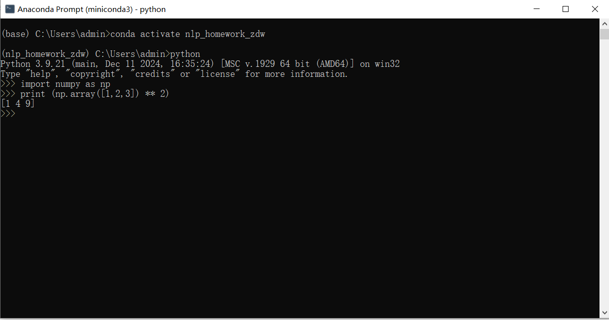
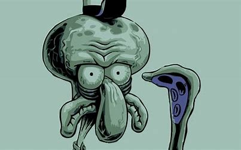

# 章鱼哥的自我介绍 <!--一级标题-->


**大家好，我是章鱼哥**，我的身份是*汉堡崽*。以下是我的自我介绍:

---

## 基础档案 <!--二级标题-->

### 外貌特征 <!--三级标题-->
- 丑陋的大鼻子
- 大鼻子

## 我的好朋友 <!--二级标题-->
1. 海绵宝宝
2. 珊迪
3. 派大星

### 重要坐标 <!--三级标题-->
[真新镇研究所](https://pokemon.fandom.com/wiki/Pallet_Town)

### 日常作息表 <!--三级标题-->
| 时间        | 活动内容 |
|-----------|------|
| 08:00     | 煎汉堡  |
| 12:30     | 煎汉堡  |
| 15:00     | 煎汉堡  |
| 20:00     | 睡觉觉  |

### 人生信条 <!--三级标题-->
> "烦死了"  
> 海绵宝宝快干活

---

## 我的专业是人工智能 <!--二级标题-->
正在学习用神经网络分析树果营养成分！

## 我最喜欢的一段代码
```python
import numpy as np
print(np.array([1,2,3])** 2)
```
其中执行 python dev_skills_env.py 可输出结果。


我最喜欢的环境管理工具是conda


我可以在IDE上使用我建立的虚拟环境



### 海绵宝宝！！！


### 海绵宝宝~ ~ ~
